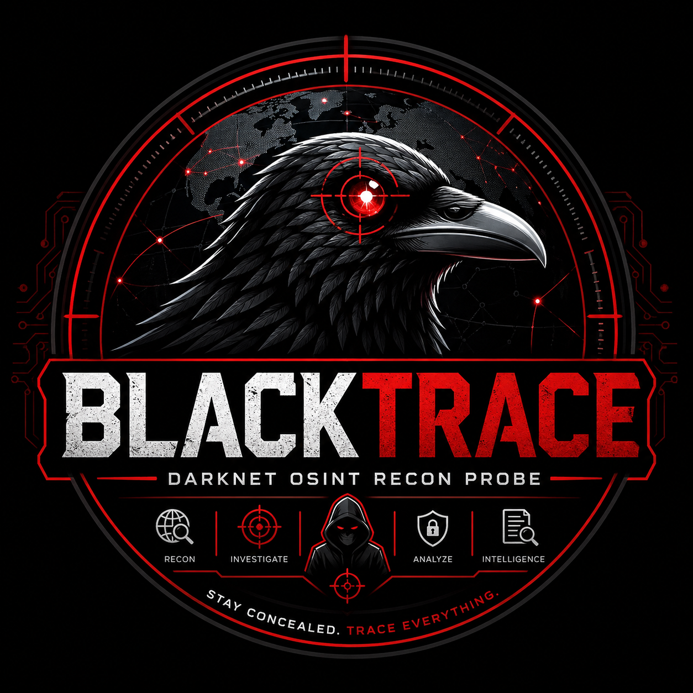

<p align="center">
  
</p>

<h1 align="center">🕶️ BlackTrace</h1>

<p align="center">
  H4CKER_FAWAD | Break systems. Understand everything.
</p>
# 🕶️ BlackTrace

### Advanced OSINT Reconnaissance Framework

```bash
██████╗ ██╗      █████╗  ██████╗██╗  ██╗████████╗██████╗  █████╗  ██████╗███████╗
██╔══██╗██║     ██╔══██╗██╔════╝██║ ██╔╝╚══██╔══╝██╔══██╗██╔══██╗██╔════╝██╔════╝
██████╔╝██║     ███████║██║     █████╔╝    ██║   ██████╔╝███████║██║     █████╗  
██╔══██╗██║     ██╔══██║██║     ██╔═██╗    ██║   ██╔══██╗██╔══██║██║     ██╔══╝  
██████╔╝███████╗██║  ██║╚██████╗██║  ██╗   ██║   ██║  ██║██║  ██║╚██████╗███████╗
╚═════╝ ╚══════╝╚═╝  ╚═╝ ╚═════╝╚═╝  ╚═╝   ╚═╝   ╚═╝  ╚═╝╚═╝  ╚═╝ ╚═════╝╚══════╝
```

> ⚡ “Trace data. Extract intelligence. Stay unseen.”

---

## 📌 Overview

**BlackTrace** is a modular Open Source Intelligence (OSINT) framework designed for cybersecurity research, digital investigations, and reconnaissance automation.

It combines multiple intelligence-gathering techniques into a single CLI-based toolkit for ethical security analysis.

---

## 🚀 Features

* 📍 Image EXIF GPS extraction
* 🌐 Username reconnaissance (multi-platform)
* 📧 Email breach & paste leak detection
* 🔎 Email verification (OSINT validation)
* 🌍 WHOIS, DNS & subdomain enumeration
* 📂 File metadata extraction
* 🧠 Automated Google Dorking
* 🕰️ Wayback Machine historical analysis
* 🌐 IP geolocation & abuse intelligence
* 📊 Website scraping + entity extraction (NLP)
* 📱 Phone number intelligence lookup
* 🖼️ Reverse image search (multi-engine)
* 🛰️ GEOINT (maps + satellite analysis)
* 📡 Port scanning & network reconnaissance
* 🧠 Threat intelligence feeds integration
* 🧾 Reddit / GitHub intelligence modules

---

## ⚙️ Requirements

* Python 3.7+
* pip
* Internet connection
* Kali Linux / Ubuntu recommended

---

## 📦 Installation

### 🔧 Quick Setup

```bash
git clone https://github.com/fawadqureshi007/Black.git
cd Black
chmod +x install.sh
./install.sh
```

---

### 🛠️ Manual Setup

```bash
sudo apt update

python3 -m venv blacktrace_env
source blacktrace_env/bin/activate

pip install -r requirements.txt

python3 -m spacy download en_core_web_sm
```

---

## ▶️ Usage

### Standard Run (Recommended)

```bash
python3 blacktrace.py
```

---

### 🔧 Advanced Run (No activation required)

```bash
./blacktrace_env/bin/python blacktrace.py
```

---

### ⚡ One-Click Execution (Best)

```bash
./run.sh
```

---

## 📄 requirements.txt

```
requests
beautifulsoup4
waybackpy
spacy
phonenumbers
exifread
tldextract
python-whois
dnspython
lxml
```

---

## 🔑 API Keys (Optional Modules)

Some features require external APIs:

* HaveIBeenPwned → [https://haveibeenpwned.com/API/Key](https://haveibeenpwned.com/API/Key)
* Hunter.io → [https://hunter.io](https://hunter.io)
* AbuseIPDB → [https://www.abuseipdb.com/api](https://www.abuseipdb.com/api)

### Set environment variables:

```bash
export HIBP_API_KEY="your_key"
export ABUSEIPDB_KEY="your_key"
export GITHUB_TOKEN="your_token"
```

---

## 🧠 Modules Overview

| #  | Module              | Description                |
| -- | ------------------- | -------------------------- |
| 1  | Image GeoLocation   | Extract GPS metadata       |
| 2  | Social Recon        | Username search            |
| 3  | Email Breach Scan   | Data leak detection        |
| 4  | Email Verification  | Email validation           |
| 5  | Domain Intelligence | WHOIS + DNS lookup         |
| 6  | Metadata Extraction | File intelligence          |
| 7  | Google Dorking      | Advanced search automation |
| 8  | Instagram Recon     | Profile analysis           |
| 9  | Port Scanner        | Network reconnaissance     |
| 10 | GitHub Recon        | Developer profiling        |
| 11 | Website Scraper     | Metadata extraction        |
| 12 | Phone Intelligence  | Carrier & region lookup    |
| 13 | Reverse Image       | Image OSINT                |
| 14 | GEOINT Ops          | Satellite mapping          |
| 15 | Wayback Analysis    | Historical recon           |
| 16 | IP Intelligence     | Abuse & blacklist checks   |
| 17 | Threat Feeds        | Cyber threat intel         |
| 18 | Reddit Recon        | Community intelligence     |

---

## ⚖️ Ethical Use

✔ Allowed:

* Educational purposes
* Cybersecurity research
* Authorized penetration testing

❌ Not allowed:

* Unauthorized tracking
* Privacy invasion
* Illegal activity

---

## 🛡️ Disclaimer

This tool is intended for **educational and authorized security testing only**.
The developer is not responsible for misuse.

---

## 👤 Author

**Fawad Qureshi**
📸 Instagram: [https://www.instagram.com/h4cker_fawad](https://www.instagram.com/h4cker_fawad)

---

## ⭐ Support

If you like this project:

* ⭐ Star the repository
* 🍴 Fork it
* 🚀 Share with cybersecurity community

---
